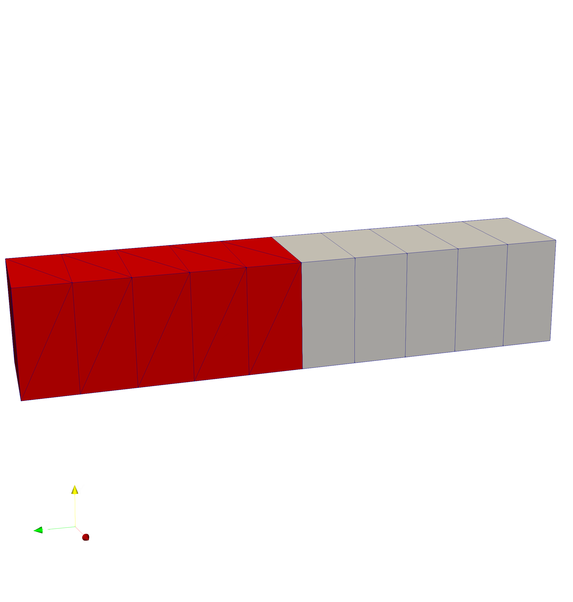
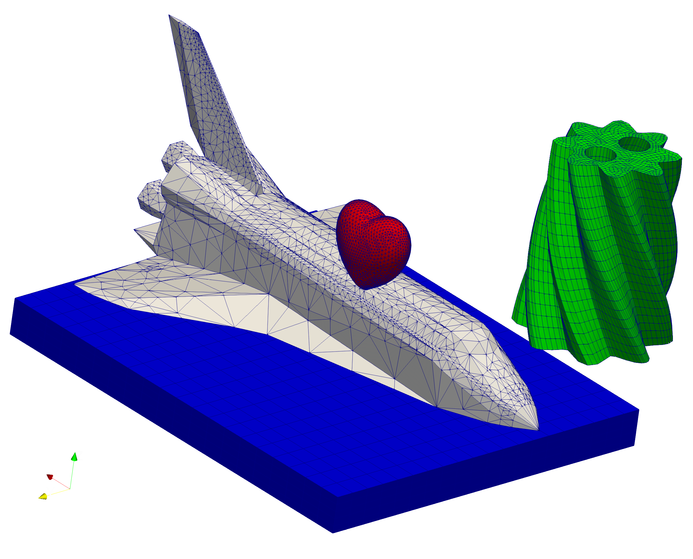

# This is EXODUS_PERIDIGM

Remark: will be merged into PERIDIGM_IO soon.




# Features:

The module provides a set of classes to handle mesh conversion.

# The EXODUS_PERIDIGM_MESH class:
* Needs a file name at construction
  ```
  EXFile = EXODUS_PERIDIGM_MESH('path/to/outputfile.ascii')
  ```
* All input by now only read in via CSV file (see examples):
  ```
  EXFile.GetNodesFromCSVFile('path/to/nodes')
  EXFile.GetElementBlockFromCSVFile('path/to/element_blk')
  EXFile.GetNodeSetFromCSVFile('path/to/node_set1')
  ```
* It is recomended to review the current input via:
  ```
  EXFile.report()
  ```
* Output is supported as .ascii (user readable) and .g (binary):
  ```
  EXFile.WriteToFile()
  EXFile.ConvertToBinary(optional(delete_ascii=True))
  ```

# ToDo:
* provide additional input mechanism for mesh data.
